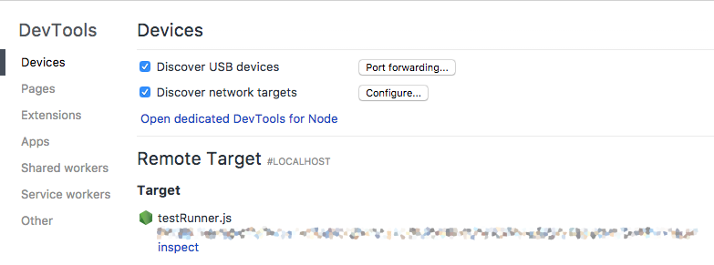
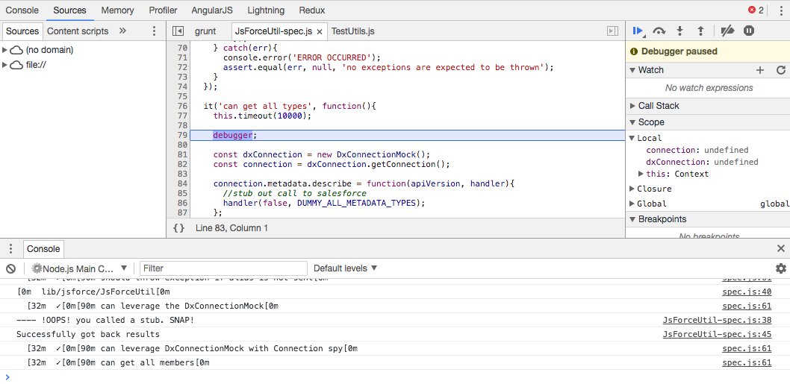

# sfdx-plugin-template 

A template for making Salesforce DX Plugins

# Steps to make your plugin

1. Install the [SDFX CLI](https://developer.salesforce.com/tools/sfdxcli)

2. Fork and Clone this repository: [i.e https://github.com/paulroth3d/sfdx-plugin-template](https://github.com/paulroth3d/sfdx-plugin-template)

3. Install npm modules: `npm install`

4. Link the plugin, so it is available for local testing: `sfdx plugins:link .`   (you should now see the plugin when you run `sfdx --help` or executing locally)

5. Develop your plugin (detail below)

6. Publish the plugin to npm, so it is available directly to end users:   `sfdx plugins:install [[your_npm_package_name]]`

# Features available:

* Code linting: `npm run lint`
  * Lint just commands `npm run lintCommands`
  * Lint Commands on save: `npm run watchCommands`
  * Lint and run tests on save: `npm run watchTests`
* Unit testing `npm run test`
* Code Coverage `npm run codeCoverage`
* Built in Debugging for Unit tests `npm run debugTests`   (see below for more)

Output for coverage is in the `coverage/lcov-report/index.html` file. Just open in your browser or expose in your CI.

# Developing your plugin

There are three main parts to creating a plugin:

**1. Define a plugin Namespace**

This is defined within index.js and is the name that people see when listing all plugins or when executing any command.

**2. Define plugin topics**

Topics are the high level collections for organizing
your plugin commands.
 
The list of all topics for a plugin can be found
by running:

	sfdx [[pluginNamespace]] --help

for example:

	#list the topics
	sfdx template --help

**3. Define and Reference Command Modules**

Commands are node module excutables that implement your plugin's functionality.

Command modules implement the following:

	module.exports = {
	  //-- which topic is the command found within
	  topic: 'example',
	
	  //-- the name of the command that this responds to
	  command: 'sayHello',
	
	  //-- description as listed from `sfdx template:example:sayHello --help`
	  description: 'description of the command',
	  help: 'Secondary help message',
	
	  //-- list of flags that are available for the command.
	  //-- These can also be found by running
	  //-- `sfdx template:example:sayHello --help`
	  flags: [{
	    
	    //-- the full text name of the command
	    name: 'msg',
	    
	    //-- alternate one character flag name
	    char: 'm',
	    
	    //-- a description for what the argument represents
	    description: 'What message to say',
	
	    //-- whether the flag requires additional information to be useful.
	    //-- For example (true): --msg "Polly want a cracker"
	    //-- as opposed to flags that indicate some condition
	    //-- For example (false): --json
	    //-- takes no argument
	    hasValue: true
	  }],
	  
	  /**
	   * The actual implementation of the command.
	   * @param {any} context - sfdx command context
	   */
	  run(context){
	  	//-- it is recommended the run returns a promise
	  	//-- this is useful for testing / combining
	  	//-- but it is not required
	  }
	}

# Debugging Your Command

With recent updates to Salesforce DX (specifically version 6.XX), debugging your commands is much easier to accomplish.

Simply pass in the `--dev-suspend` command line argument, and a debugger will be started.

	> sfdx template:example:sayHello --dev-suspend
	Debugger listening on ws://127.0.0.1:9229/31da11bf-02d2-4dd6-81ac-3c30056b7a49
	For help see https://nodejs.org/en/docs/inspector
	Debugger attached.
	
This opens a websocket for debugging the app (the code is automatically paused before execution)

Chrome provides built-in tools for connecting to the web-sockets for debugging with two options:

**Option 1**: The simplest way is to open the url `chrome://inspect` within chrome.

Refreshing this page will show an active list of all debugger instances running, without constantly copy and pasting the random url.

**Option 2**: Alternatively, you can use the Chrome Extension NIM (Node Inspector Manager)   [https://chrome.google.com/webstore/detail/nim-node-inspector-manage/gnhhdgbaldcilmgcpfddgdbkhjohddkj](https://chrome.google.com/webstore/detail/nim-node-inspector-manage/gnhhdgbaldcilmgcpfddgdbkhjohddkj)

# Debugging Unit Tests

Unit tests from this template use Grunt / Mocha to run unit tests.

A command was included within the list of pre-configured scripts.

Simply run `npm run debugTests` to start the nodeDebugger script.

(See debugging your code for more)

# Continuing the conversation

For more information, please see the following:

[Become a SFDX CLI Ninja](https://www.youtube.com/watch?v=dWUQOy2qdTc&t=7m40s)